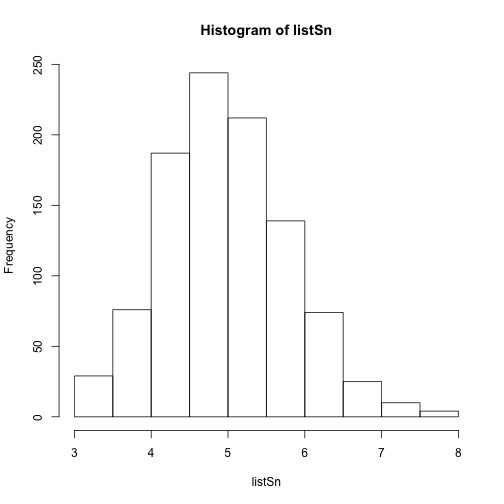
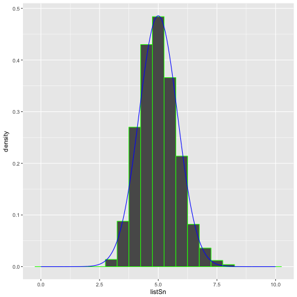

Title: Data Science Speciliation - Statistical Inference Course Project

Overview:
The report summarizes the investigation about the exponential distribution in R, comparing it with Center Limit Theorem.
By using R function to exercise, the report answers the following questions
1.1 Whats the relationship between sample mean and theoretical mean
1.2 Whats the relationship between sample variance and theoretical variance
1.3 How to tell the distribution is approximately normal

Conclusion:
From the report, its concluded that that the distribution of averages of iid variables becomes that of a standard normal as the sample size increases.

Assumption: 
The exercise is run inside R environment, the max number of exercise is 1000


```r
library(ggplot2)
library(gridExtra)
set.seed(1977)
lambda <- 0.2
n <- 40
totalsn <- 1000
listSn <- c(totalsn)
for (i in 1:totalsn) {
  listSn[i] <- mean(rexp(n,lambda))  
}
hist(listSn)
```



The above figure shows the distribution is centered


```r
# Display the distribution is centered by comparison with theoretical center of distribution
var1 <- mean(listSn)
var2 <- 1/lambda
var1
```

```
## [1] 4.987087
```

```r
var2
```

```
## [1] 5
```

```r
diff1 <- var1 - var2
diff1
```

```
## [1] -0.01291308
```

```r
# 
```
The difference of 1.29% shows sample mean and theoritical mean are almost the same


```r
# std
var3 <- sd(listSn)
var4 <- var2/sqrt(40)
diff2 <- var3 - var4
diff2
```

```
## [1] 0.03087797
```


```r
# variance
var5 <- sd(listSn)^2
var6 <- var3^2
diff3 <- var5 - var6
diff3
```

```
## [1] 0
```

The difference of 0% shows sample variance and theoritical variance are same


```r
# Show that the distr is normal
dnormx <- seq(0,10,.01)
dnormy <- dnorm(dnormx, 5, var3)
tbSn <- data.frame(listSn)
tbDnorm <- data.frame(dnormx,dnormy)

g1 <- ggplot(tbSn, aes(x=listSn)) + geom_histogram(aes(y=..density..), binwidth=0.5, col="green")
g2 <- g1 + geom_line(data = tbDnorm, aes(x=dnormx,y=dnormy), col = "blue")
g2
```


The above figure display the normal distribution(in blue color) and density of sample exercise. From the figure, its cleared stated that they are same


```r
confLevel <- mean(listSn) + c(-1,1) * 1.96 * var3 / sqrt(length(listSn))
confLevel
```

```
## [1] 4.936173 5.038001
```
The above number is the confidence level
