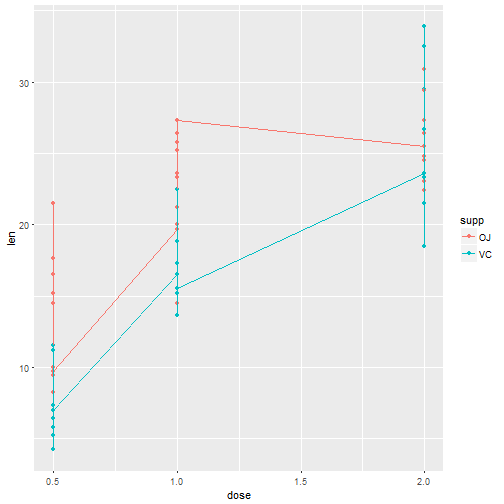

Title:
The report Basic inferential data analysis for ToothGrowth

Author: 
Ken Gu


Overview:

This report use basic exploratory data analysis to check the ToothData 
The report calculate the following numbers:
mean data for each dose/supp
pvalue and confidence for supp 
pvalue and confidence for dose


```r
library(ggplot2)
library(dplyr)
data(ToothGrowth)
```

Step 1: Load the data and plot the data based on the supp


```r
head(ToothGrowth)
```

```
##    len supp dose
## 1  4.2   VC  0.5
## 2 11.5   VC  0.5
## 3  7.3   VC  0.5
## 4  5.8   VC  0.5
## 5  6.4   VC  0.5
## 6 10.0   VC  0.5
```

```r
g1 <- ggplot(ToothGrowth, aes(x=dose, y=len))
g1 + geom_point(aes(colour=supp)) + geom_line(aes(colour=supp))
```



Step 2: Use groupby method to display the mean of each supp/dose


```r
grp <- group_by(ToothGrowth, supp,dose)
summary1 <- summarise(grp, meanlen = mean(len) )
summary1
```

```
## Source: local data frame [6 x 3]
## Groups: supp [?]
## 
##     supp  dose meanlen
##   <fctr> <dbl>   <dbl>
## 1     OJ   0.5   13.23
## 2     OJ   1.0   22.70
## 3     OJ   2.0   26.06
## 4     VC   0.5    7.98
## 5     VC   1.0   16.77
## 6     VC   2.0   26.14
```

Step 3: 


```r
# Step 3.1: Compare Supp
test1 <- t.test(ToothGrowth$len ~ ToothGrowth$supp, data = ToothGrowth)
test1$p.value
```

```
## [1] 0.06063451
```

```r
test1$conf.int
```

```
## [1] -0.1710156  7.5710156
## attr(,"conf.level")
## [1] 0.95
```
Because the p-value is greater than 5%, so it will not be included


```r
# Step 3.2: Compare Dose
dose5 <- filter(ToothGrowth, dose==0.5)$len
dose10 <- filter(ToothGrowth, dose==1.0)$len
dose20 <- filter(ToothGrowth, dose==2.0)$len

# Check dose5 and dose10 p-value
pdose5_dose10_test1 <- t.test(dose5, dose10, paired=FALSE, var.equal=TRUE)
pdose5_dose10_test2 <- t.test(dose5, dose10, paired=FALSE, var.equal=FALSE)
pdose5_dose10_test1$p.value
```

```
## [1] 1.266297e-07
```

```r
pdose5_dose10_test2$p.value
```

```
## [1] 1.268301e-07
```

```r
pdose5_dose10_test1$conf.int
```

```
## [1] -11.983748  -6.276252
## attr(,"conf.level")
## [1] 0.95
```

```r
pdose5_dose10_test2$conf.int
```

```
## [1] -11.983781  -6.276219
## attr(,"conf.level")
## [1] 0.95
```

```r
pdose10_dose20_test1 <- t.test(dose10, dose20, paired=FALSE, var.equal=TRUE)
pdose10_dose20_test2 <- t.test(dose10, dose20, paired=FALSE, var.equal=FALSE)
pdose10_dose20_test1$p.value
```

```
## [1] 1.810829e-05
```

```r
pdose10_dose20_test2$p.value
```

```
## [1] 1.90643e-05
```

```r
pdose10_dose20_test1$conf.int
```

```
## [1] -8.994387 -3.735613
## attr(,"conf.level")
## [1] 0.95
```

```r
pdose10_dose20_test2$conf.int
```

```
## [1] -8.996481 -3.733519
## attr(,"conf.level")
## [1] 0.95
```

```r
pdose5_dose20_test1 <- t.test(dose5, dose20, paired=FALSE, var.equal=TRUE)
pdose5_dose20_test2 <- t.test(dose5, dose20, paired=FALSE, var.equal=FALSE)
pdose5_dose20_test1$p.value
```

```
## [1] 2.837553e-14
```

```r
pdose5_dose20_test2$p.value
```

```
## [1] 4.397525e-14
```

```r
pdose5_dose20_test1$conf.int
```

```
## [1] -18.15352 -12.83648
## attr(,"conf.level")
## [1] 0.95
```

```r
pdose5_dose20_test2$conf.int
```

```
## [1] -18.15617 -12.83383
## attr(,"conf.level")
## [1] 0.95
```
Because all p-value are less than 5%, so its clearly stated that the dose has a strong impact on the tooth length

Conclusion: 
The above report shows that 'dose's increasement can directly impact tooth growth', while supplement does not have impact.

